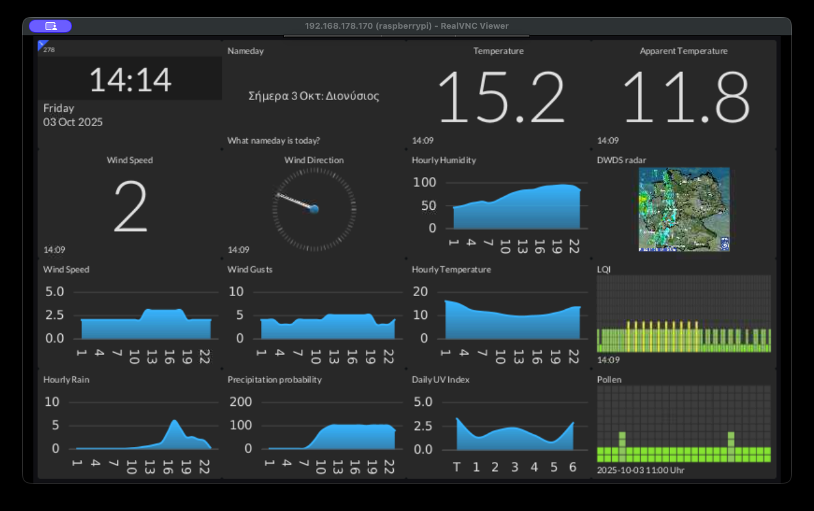

# PiMonitor

A WeatherStation with
- JavaFX
- Akka (https://www.akka.io/)
- OpenMeteo (https://open-meteo.com/)
- Greek Namedays (https://www.eortologio.net/)
- LQI monitoring (https://www.umweltbundesamt.de/api/air_data/v3/airqualityforecast/) 
- Pollen monitoring from DWD (https://opendata.dwd.de/climate_environment/health/alerts/s31fg.json)
- and with the help of tilesfx (https://github.com/HanSolo/tilesfx)

